# DINOv3, Explained — A Visual Learning Resource

> **Goal:** understand, in extensive detail and with as many pictures as
> possible, how **DINOv3** works — Meta AI's 2025 self-supervised vision
> foundation model.

This repository is a **teaching artifact**. Running its scripts produces
**24 multi-panel figures** (well over a hundred individual visualizations);
this README walks through them in order. The full write-up is in
[`docs/THEORY.md`](docs/THEORY.md); the DINOv3-specific changes are in
[`docs/DINOV3_VS_DINOV2.md`](docs/DINOV3_VS_DINOV2.md); every figure is
catalogued in [`docs/VISUALIZATION_GUIDE.md`](docs/VISUALIZATION_GUIDE.md).

> **A note on weights.** DINOv3's weights are gated on Hugging Face, so the
> live figures run on **DINOv2** [2] — openly downloadable and mechanically
> near-identical (same ViT, same DINO + iBOT + KoLeo training, optional
> register tokens). Every *mechanism* shown is the one DINOv3 uses; the
> docs add what DINOv3 specifically changed. An optional DINOv3 code path
> (`src/dinov3_loader.py`) is included for anyone who has access.

---

## DINO in three paragraphs

A normal image model learns from **(image, label)** pairs. Labels are
expensive, cap the dataset size, and make the model discard everything the
label does not need. **Self-supervised learning** drops labels entirely:
the model is trained only to produce **consistent representations of the
same image under different crops and distortions**. To succeed it must
discover what is *stable* about an image — its content — which is exactly
what downstream tasks want.

DINO [1] does this by **self-distillation**. Two copies of a Vision
Transformer are kept: a **student**, trained by gradient descent, and a
**teacher**, whose weights are a slow exponential moving average (EMA) of
the student's. Both see different crops of one image; the student is
trained so its output distribution matches the teacher's. Two tricks —
**centering** and **sharpening** the teacher — stop the trivial solution
where every image maps to the same vector.

**DINOv3** [3] keeps that recipe and scales it to a 7-billion-parameter ViT on
1.7 billion images, then fixes a newly-found failure mode of very long
training — *dense features slowly decay* — with **Gram anchoring**. The
result is the first self-supervised model to beat weakly-supervised models
on dense tasks (segmentation, depth) **with the backbone frozen**.

---

## Quick start

Requires [`uv`](https://docs.astral.sh/uv/) and (ideally) an NVIDIA GPU.

```bash
uv sync                                   # create the env, install deps
uv run python scripts/00_setup_check.py   # verify CUDA + download a backbone

# generate every figure (each writes to assets/<group>/)
for s in 01 02 03 04 05 06 07 08 09 10; do
    uv run python scripts/${s}_*.py
done

# the from-scratch training demo
uv run python scripts/11_run_mini_training.py
uv run python scripts/12_training_visuals.py

uv run python scripts/13_build_readme_assets.py   # verify all figures exist
```

First run downloads the DINOv2 backbones, Oxford-IIIT Pet [13] and
STL-10 [12] (~4 GB total, cached afterwards).

---

## 1. The Vision Transformer backbone

DINO trains a **Vision Transformer (ViT)** [4, 5]. The image is cut into a grid
of fixed-size **patches**; each patch is linearly embedded into a **token
vector**. A learned **CLS token** is prepended to summarise the whole
image, along with a few **register tokens** [6] (scratch space). The tokens
pass through transformer blocks of self-attention + MLP.

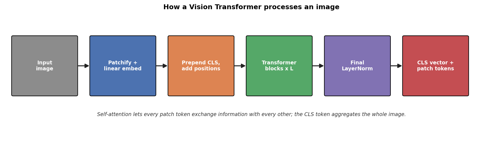
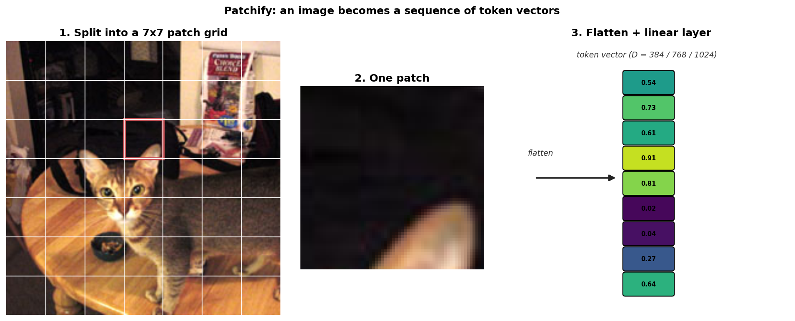
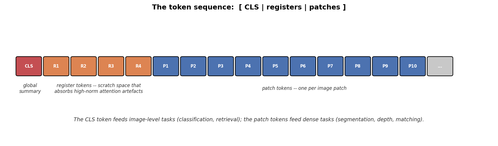

Position must be injected separately, because attention is order-blind.
DINOv2 uses *learned* positional embeddings; **DINOv3 uses rotary
embeddings (RoPE)** [8] that encode *relative* position and rescale cleanly to
new resolutions.

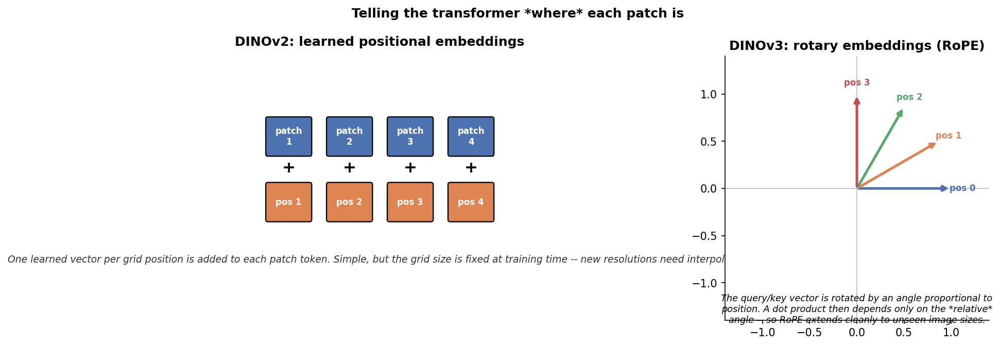

Run the backbone on real photos and project each patch's feature vector to
RGB with PCA: **semantic regions emerge**, and the first PCA component
alone segments foreground from background — a free, label-free segmenter.

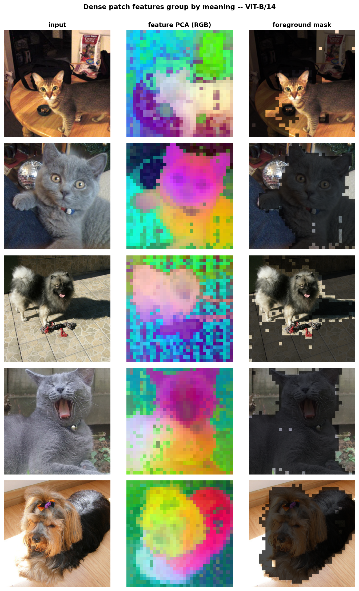

Those features **sharpen with depth** — early blocks resemble texture,
late blocks resemble object parts.

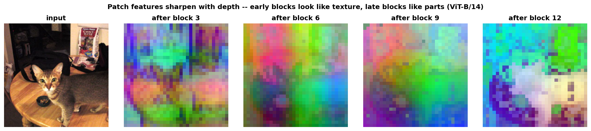

---

## 2. Attention — where the model looks

Reading the CLS token's attention shows where the model attends. Different
**heads specialise** on different regions; the average map tracks the
salient object.

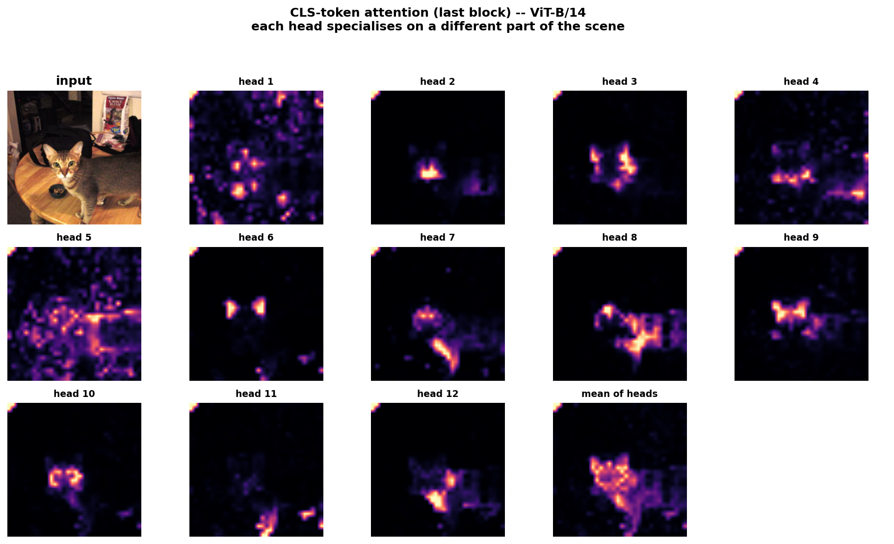
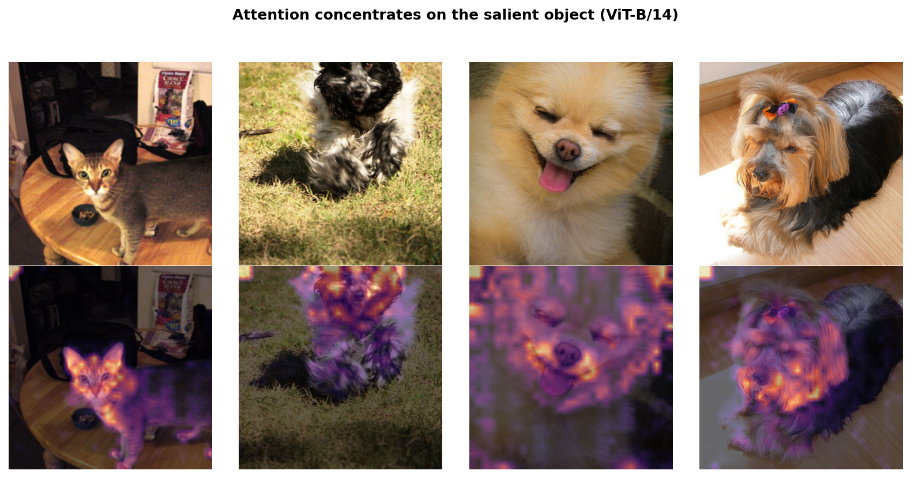

A ViT without **register tokens** dumps high-magnitude information into
random background patches, creating bright artefacts. Register tokens give
it somewhere else to put that information.

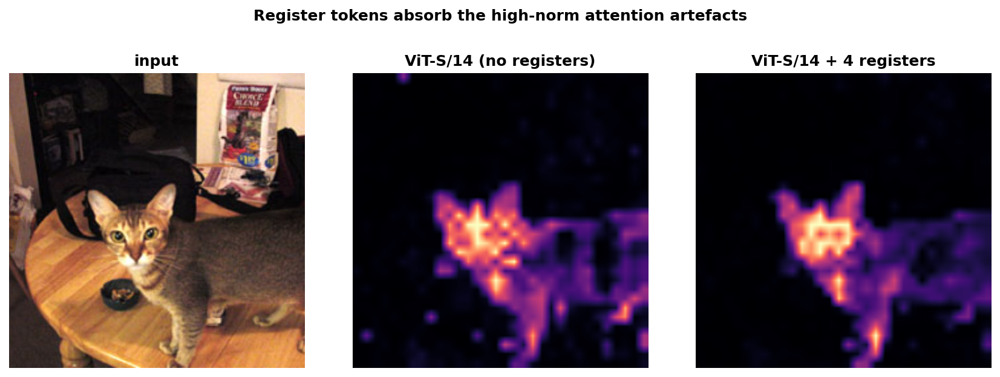

---

## 3. Patch similarity and correspondence

Patch features are L2-normalised, so a dot product is a cosine similarity.
Pick one patch and score every other patch against it — semantically
similar patches light up across the whole image.

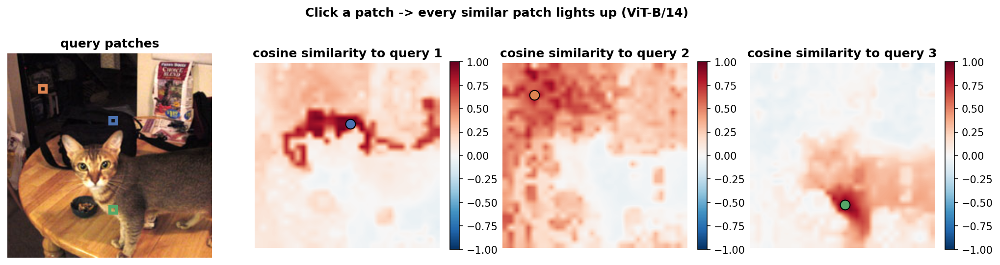
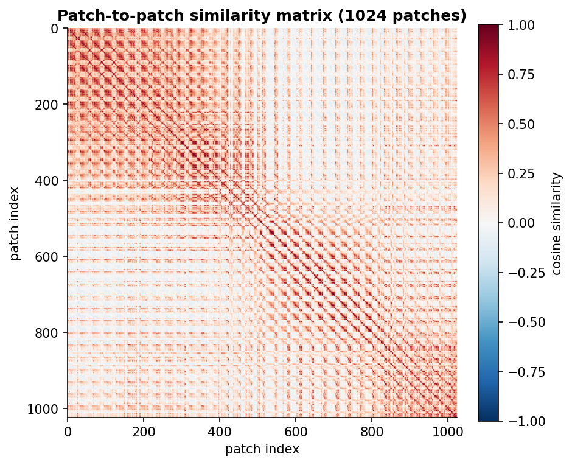

The full patch-to-patch similarity matrix above is exactly what DINOv3's
**Gram anchoring** protects (see §6). Matching patches *across two images*
gives **dense correspondence** — ear matches ear, paw matches paw — with
no supervision at all.

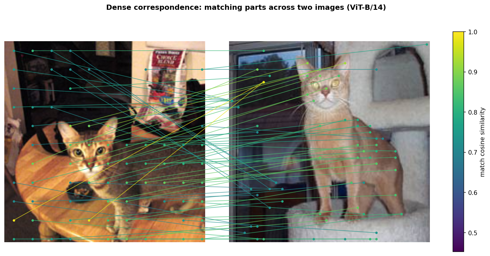

---

## 4. Self-distillation — how it is trained

The training loop: a **student** (gradient descent) and an EMA **teacher**;
**multi-crop** views of one image; a loss that makes the student match the
teacher, kept from collapsing by **centering** and **sharpening**.

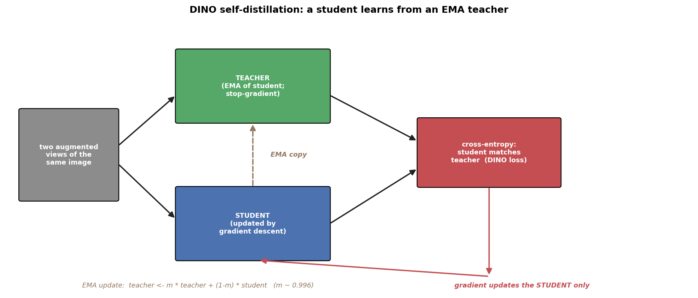
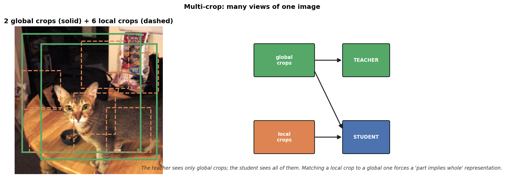
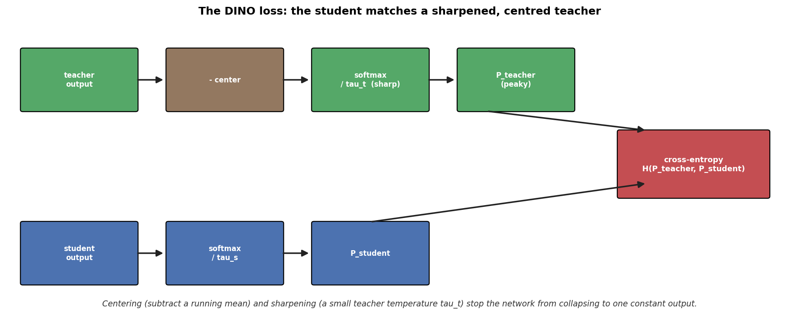

DINOv2/DINOv3 add two objectives: **iBOT** [7] (predict masked patches —
sharp dense features) and **KoLeo** [9] (spread embeddings — better
retrieval).

---

## 5. Using the frozen features

A trained backbone is **frozen** and reused. t-SNE / UMAP [10, 11] of CLS
embeddings show **classes clustering with no labels used in training**:

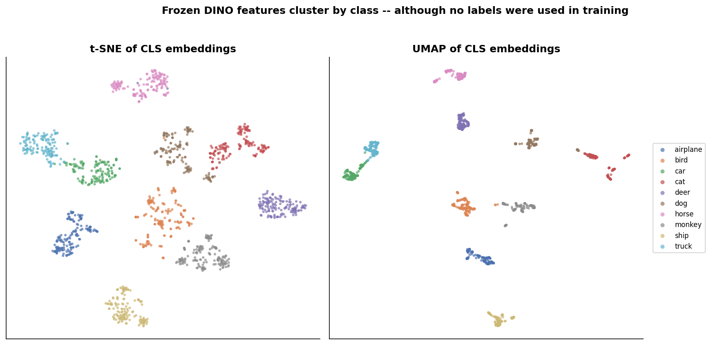

Quantitatively — **k-NN** (no training) and a **linear probe** (one linear
layer) on frozen STL-10 features:

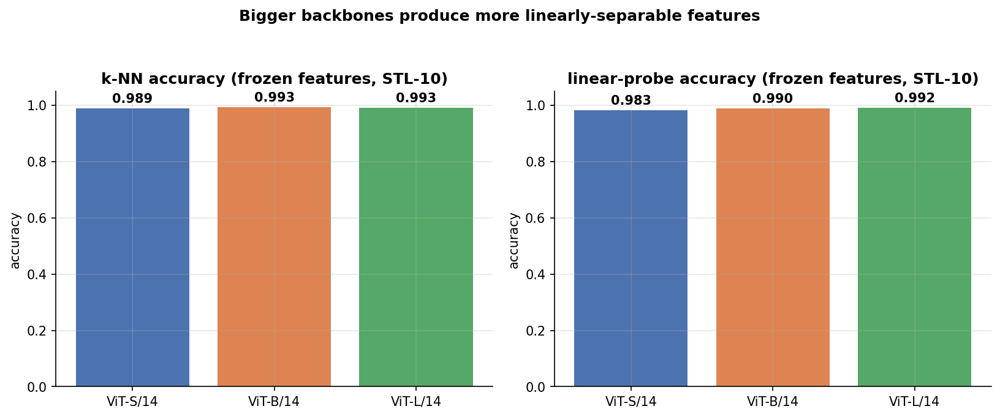
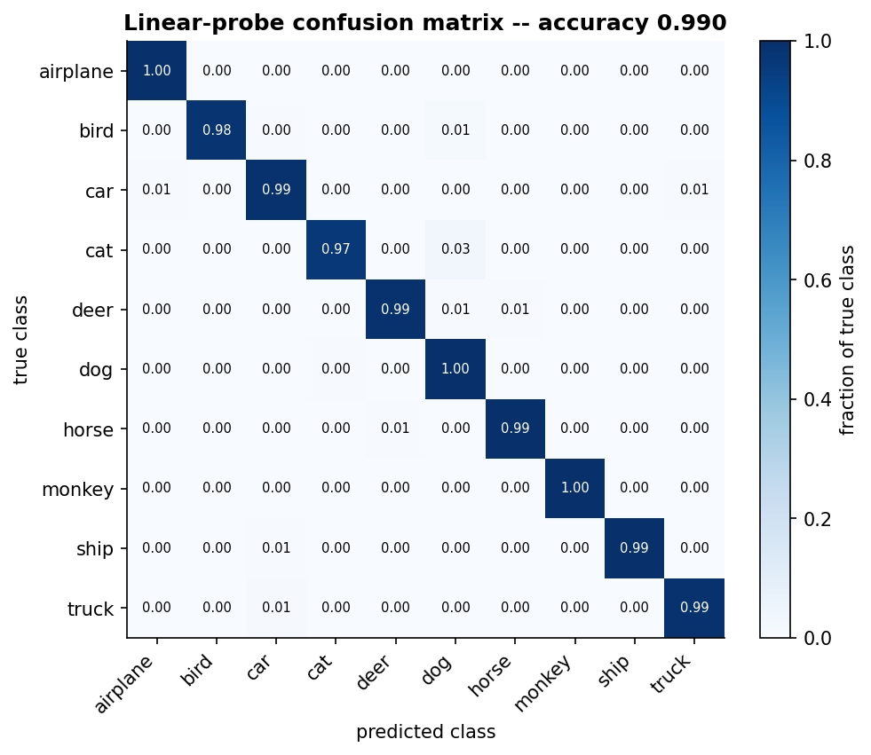

| Backbone | Parameters | k-NN acc. | Linear-probe acc. |
|---|---|---|---|
| ViT-S/14 | 22.1 M | 0.989 | 0.983 |
| ViT-B/14 | 86.6 M | 0.993 | 0.990 |
| ViT-L/14 | 304.4 M | 0.993 | 0.992 |

Bigger backbones cost more but yield richer, more separable features:

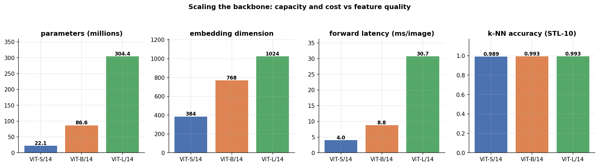

Higher input resolution gives a finer patch grid (and finer dense
predictions) — what DINOv3's RoPE is built to support:

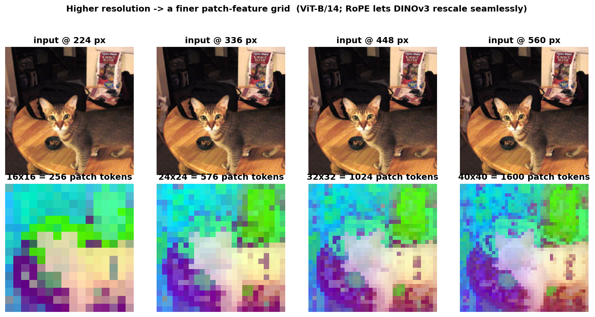

Frozen features also do **image retrieval** directly — nearest neighbours
in feature space (green title = correct class):

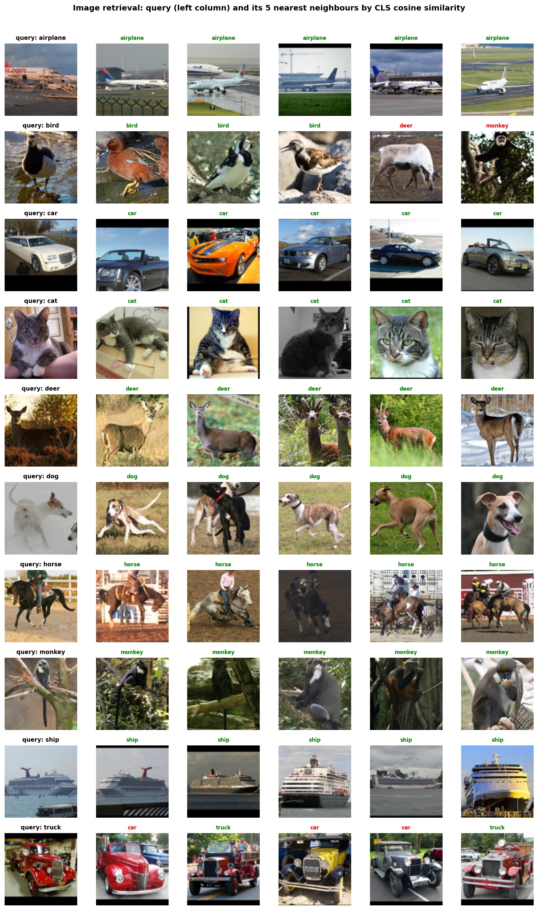

---

## 6. What DINOv3 adds over DINOv2

Same recipe, four changes (full detail in
[`docs/DINOV3_VS_DINOV2.md`](docs/DINOV3_VS_DINOV2.md)):

1. **Scale** — a 7-billion-parameter ViT on 1.7 billion curated images.
2. **Gram anchoring** — *the headline fix.* Over long training, dense patch
   features quietly decay even as global metrics improve. DINOv3 keeps a
   frozen early checkpoint and adds a loss that aligns the **Gram matrix**
   (the patch-to-patch similarity matrix) to it — pinning the *relational*
   structure while leaving features free to keep improving.
3. **RoPE + high-resolution adaptation** — rotary positions let the model
   run at resolutions it never trained on.
4. **A distilled model family** — the 7 B teacher is distilled into
   ViT-S/B/L/H + ConvNeXt, plus a `dino.txt` text encoder.

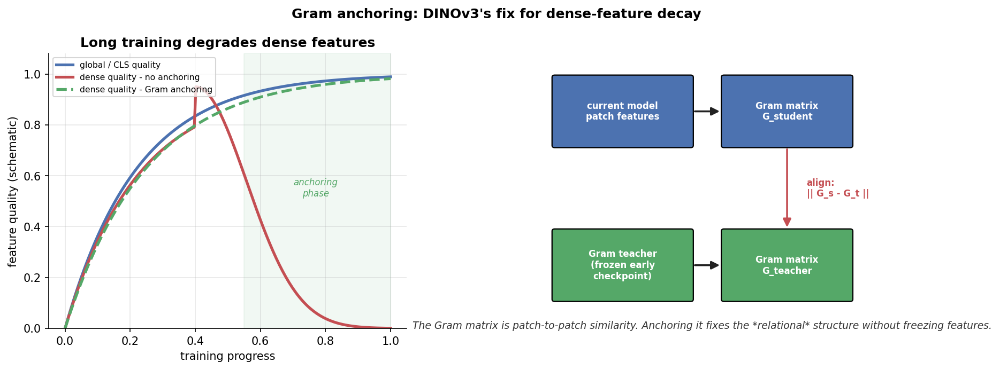

---

## 7. The mechanism, live — a from-scratch training demo

Theory aside, `scripts/11`–`12` actually *run* DINO: a ~3.4 M-parameter
TinyViT trained from scratch with the self-distillation loop on the
**unlabelled** STL-10 split (30 epochs, ~23 min on one RTX 4090). The
**loss falls** (7.60 → 6.42) as the student learns to track the teacher,
the **(monitoring-only) k-NN accuracy rises to ~0.31 — about 3× the 10 %
chance level** — and the EMA momentum follows its cosine schedule:

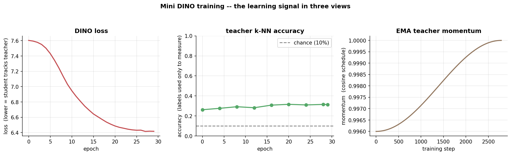

This is a deliberately tiny demo (a small model, 12 k images, the DINO
loss only — no iBOT or KoLeo), so the numbers are modest; the point is to
*see the mechanism work*. The real DINOv3 applies the same loop at a
scale millions of times larger.

And watch patch-feature structure **emerge from noise** as training
proceeds:

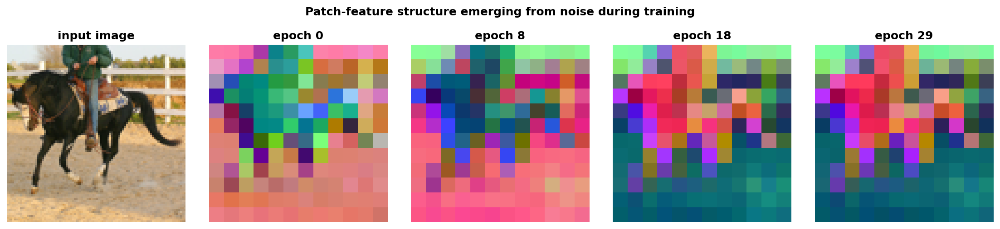

That is DINO end to end: no labels in, useful structure out.

---

## Project structure

```
src/                core library (each file <= 150 lines, heavily commented)
  config, paths, device, plot_style       settings & infrastructure
  backbone_loader, dinov3_loader          model loading (DINOv2 / optional DINOv3)
  attention_hook, features, image_io      feature & attention extraction
  datasets, eval_features                 data access & cached features
  decomposition, similarity               PCA / t-SNE / UMAP, cosine similarity
  knn_eval, linear_probe                  frozen-feature evaluation
  diagrams_*                              concept-diagram drawing
  training/                               the mini DINO demo
scripts/00..13      entry points; each generates one group of figures
docs/               PRD, PLANNING, TASKS, THEORY, DINOV3_VS_DINOV2, VISUALIZATION_GUIDE
assets/             generated figures (PNG + JSON sidecars)
```

## Further reading in this repo

- `docs/THEORY.md` — the full, ordered explanation.
- `docs/DINOV3_VS_DINOV2.md` — the comparison and the Gram-anchoring deep dive.
- `docs/VISUALIZATION_GUIDE.md` — every figure: what, how, takeaway.

## References

**The DINO family**

1. Caron, M., Touvron, H., Misra, I., Jégou, H., Mairal, J., Bojanowski, P.,
   & Joulin, A. (2021). *Emerging Properties in Self-Supervised Vision
   Transformers* (DINO). ICCV.
   [arXiv:2104.14294](https://arxiv.org/abs/2104.14294)
2. Oquab, M., Darcet, T., Moutakanni, T., et al. (2023/2024). *DINOv2:
   Learning Robust Visual Features without Supervision.* TMLR.
   [arXiv:2304.07193](https://arxiv.org/abs/2304.07193)
3. Siméoni, O., et al. (2025). *DINOv3.*
   [arXiv:2508.10104](https://arxiv.org/abs/2508.10104)

**Architecture & training components**

4. Dosovitskiy, A., et al. (2021). *An Image is Worth 16×16 Words:
   Transformers for Image Recognition at Scale* (ViT). ICLR.
   [arXiv:2010.11929](https://arxiv.org/abs/2010.11929)
5. Vaswani, A., et al. (2017). *Attention Is All You Need.* NeurIPS.
   [arXiv:1706.03762](https://arxiv.org/abs/1706.03762)
6. Darcet, T., Oquab, M., Mairal, J., & Bojanowski, P. (2024). *Vision
   Transformers Need Registers.* ICLR.
   [arXiv:2309.16588](https://arxiv.org/abs/2309.16588)
7. Zhou, J., et al. (2022). *iBOT: Image BERT Pre-Training with Online
   Tokenizer.* ICLR. [arXiv:2111.07832](https://arxiv.org/abs/2111.07832)
8. Su, J., Lu, Y., Pan, S., Murtadha, A., Wen, B., & Liu, Y. (2021).
   *RoFormer: Enhanced Transformer with Rotary Position Embedding* (RoPE).
   [arXiv:2104.09864](https://arxiv.org/abs/2104.09864)
9. Sablayrolles, A., Douze, M., Schmid, C., & Jégou, H. (2019). *Spreading
   Vectors for Similarity Search* (KoLeo regularisation). ICLR.
   [arXiv:1806.03198](https://arxiv.org/abs/1806.03198)

**Visualization methods & datasets**

10. van der Maaten, L., & Hinton, G. (2008). *Visualizing Data using
    t-SNE.* Journal of Machine Learning Research, 9, 2579–2605.
11. McInnes, L., Healy, J., & Melville, J. (2018). *UMAP: Uniform Manifold
    Approximation and Projection for Dimension Reduction.*
    [arXiv:1802.03426](https://arxiv.org/abs/1802.03426)
12. Coates, A., Lee, H., & Ng, A. Y. (2011). *An Analysis of Single-Layer
    Networks in Unsupervised Feature Learning* (STL-10 dataset). AISTATS.
13. Parkhi, O. M., Vedaldi, A., Zisserman, A., & Jawahar, C. V. (2012).
    *Cats and Dogs* (Oxford-IIIT Pet dataset). CVPR.

*Citations [n] in the text above point to this list. DINOv3 architecture
details are drawn from [3]; the live figures use DINOv2 weights [2].*
